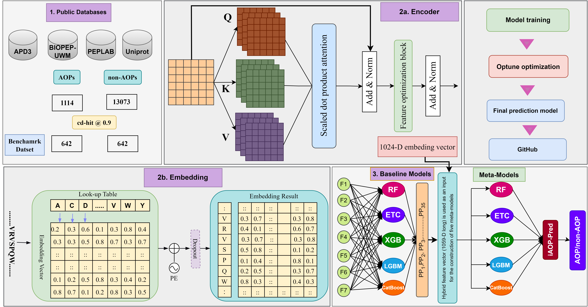

# iAOP-Pred: Adaptive learning embedding and probabilistic features to improve the identification of anti-oxidative peptides
## Antioxidant peptides, especially those derived from food, are considered to be potential rivals to synthetic antioxidants in the battle against diseases caused by free radicals because of their high activity, safety, and abundance of sources. The need to develop computationally-based techniques has increased due to the time-consuming and tedious trial-and-error process of discovering antioxidative peptides (AOPs) in wet labs. There exist two predictive methods, and both predictors are unfeasible due to the peptide sequence length constraint. A unique predictor might be helpful in the context of AOP prediction. We constructed 35 baseline models using five conventional machine learning (ML) classifiers and seven distinct handcrafted descriptors to generate a 35-D probabilistic feature vector. Also, we used the adaptive learning embedding algorithm, which enables the automatic extraction of context-specific sequential features and global information. Comparative analysis of features showed that the combination of probabilistic and adaptive embedding features (hybrid feature set) is superior to handcrafted compositional-based descriptors. The ensemble model, iAOP-Pred, trained on the hybrid feature vector outperformed the baseline models and the state-of-the-art models on the benchmark dataset. For the purpose of screening and identifying possible AOPs, we anticipate that the iAOP-Pred method will be an invaluable tool.

# Installation requirements
------------------------------------------------------------------------
1. scikit-learn  === 1.2.1
2. xgboost === 1.6.1
3. catboost === 1.2.5
4. lightgbm === 4.3.0
5. Optuna === 3.6.0
